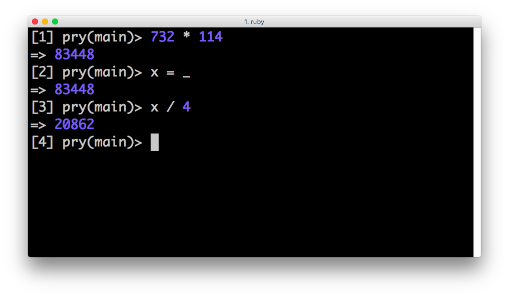
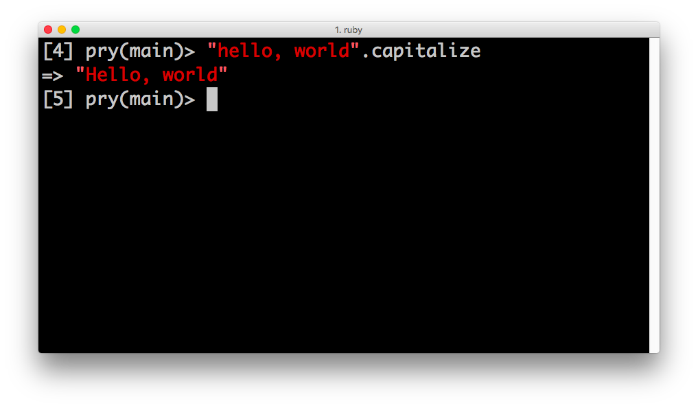
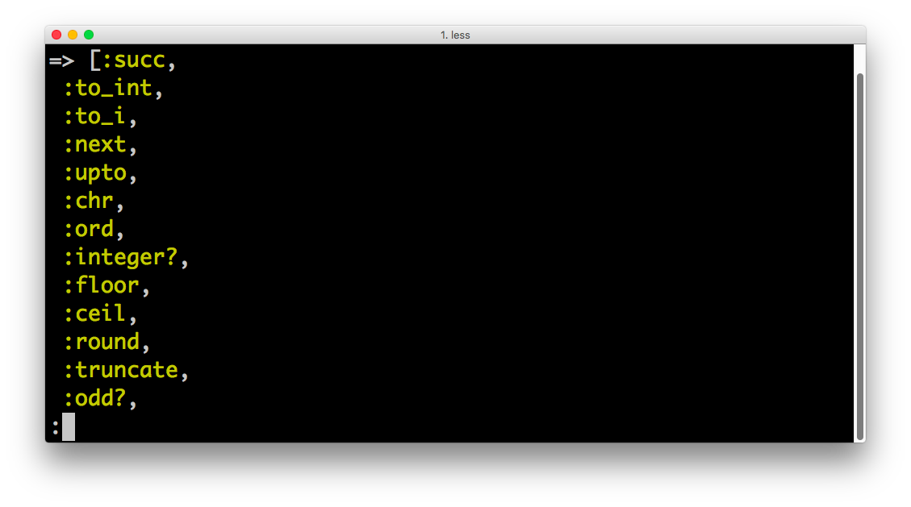
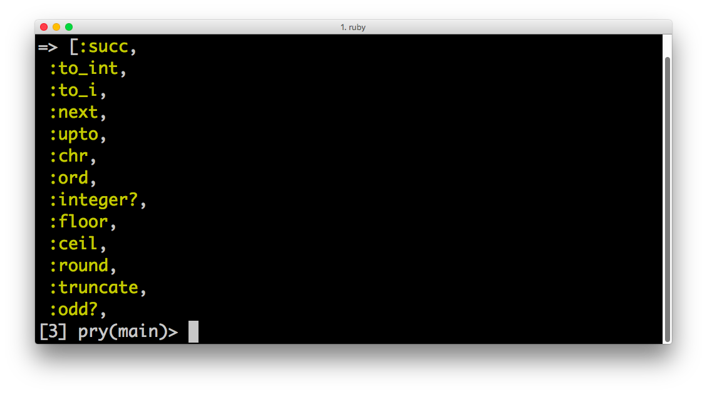

# REPL Exercises

0. Install `pry` via the instructions in the reading

0. Use pry to figure out what 732 * 114 is
  * Create a variable, x, and then assign it to the last return value by using the underscore, `_`
  * Then, divide x by 4

0. Capitalize a string by using ruby's `#capitalize` method

0. Type `Integer.instance_methods`, notice that this returns a *really long list* of method names. We could use the down arrow key to scroll down to the bottom, but that would take forever...
  * Press `Q` to truncate the list and get a new pry prompt
  * Then, use `clear` (or `cmd + K`) to clear the output

